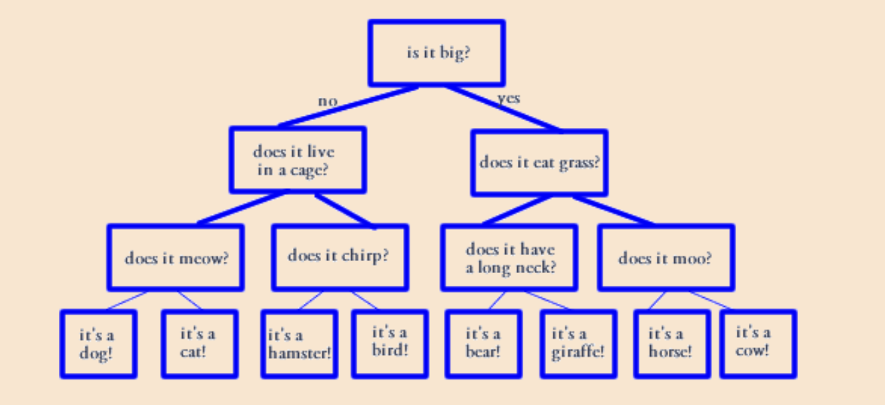

# Animal Experts

An animal decision tree for guessing the user's animal.
This is a lab project for CS 230X.

## Contents

* `README.md`: this file, describe the repo
* `AnimalExpert.java`: the major code, create the decision tree and ask the user to guess
* `TreeDriver.java`: the code for testing whether the functions of default files (javafoundations) work

## Getting Started

1. Clone this repo.
2. Run `javac AnimalExpert.java` to compile the code.
3. Run  `java AnimalExpert` to run the code.

## Requirements

[Lab 12 Descriptions](https://docs.google.com/document/d/1f8oMO0G924o4c80mRYuyouP_eggNs7bZhGUMaltwu6k/edit?tab=t.0)